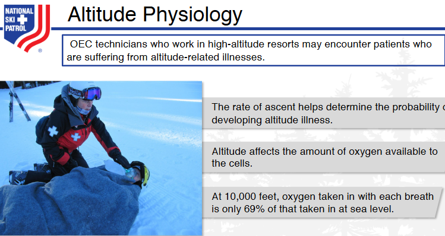
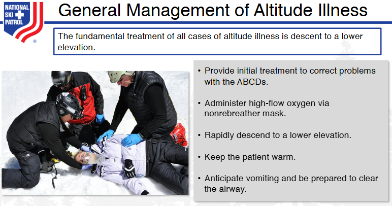

    
# Nsp Oec Training Chapter 28 

## National Ski Patrol - Outdoor Emergency Care chapter 28

    

    

## Chapter 28: Altitude-Related Emergencies
28-1: Define altitude.
28-2: Explain what happens to oxygen as altitude increases. 
28-3: List risk factors for the development of altitude illnesses. 
28-4: Describe strategies to prevent altitude illness. 
28-5: List the signs & symptoms of altitude illnesses.
28-6: Describe how to assess a patient with altitude illness. 
28-7: Describe the treatment of a patient with altitude illness. 

    

    
## Getting Started

The goal of this solution is to **Jump Start** your development and have you up and running in 30 minutes. 

To get started with the **Nsp Oec Training Chapter 28** solution repository, follow these steps:
1. Clone the repository to your local machine.
2. Install the required dependencies listed at the top of the notebook.
3. Explore the example code provided in the repository and experiment.
4. Run the notebook and make it your own - **EASY !**
    
## List of Figures
    
    

## Github https://github.com/JoeEberle/ - Email  josepheberle@outlook.com 
    

    