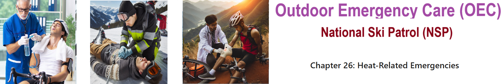

    
# Nsp Oec Training Chapter 28 

## National Ski Patrol - Outdoor Emergency Care chapter 28

    

    

## Chapter 28: Altitude-Related Emergencies
28-1: Define altitude.
28-2: Explain what happens to oxygen as altitude increases. 
28-3: List risk factors for the development of altitude illnesses. 
28-4: Describe strategies to prevent altitude illness. 
28-5: List the signs & symptoms of altitude illnesses.
28-6: Describe how to assess a patient with altitude illness. 
28-7: Describe the treatment of a patient with altitude illness. 

    

    